# Abstract

Visual Geometry Bench measures LLM spatial cognition through questions that compel humans to visualise in order to solve, aka test the "Geometric Intuition".
We probe how models reconstruct global structure from fragments, reason across spatial hierarchies, and infer topological relationships, all without visual input.

## Tasks

### Convex Hull Ordering
Given scattered 2D points, identify which lie on the convex boundary and order them counter-clockwise. Points cluster near edges to stress global shape recovery amidst local clutter. Models must distinguish boundary from interior and maintain rotational consistency.

<details open>
<summary style="cursor:pointer; font-weight:600;">Sample Question 1</summary>

<div style="display:flex;flex-direction:column;gap:14px;margin:12px 0;">
  <details open>
    <summary style="cursor:pointer;font-weight:600;">Question &amp; Prompt</summary>
    <div style="display:flex;gap:16px;flex-wrap:wrap;align-items:flex-start;margin-top:8px;">
      <figure style="flex:1;min-width:260px;margin:0;text-align:center;display:flex;flex-direction:column;align-items:center;">
        
        <figcaption><strong>Question visual/answer</strong></figcaption>
      </figure>
      <pre style="flex:1.5;min-width:320px;max-height:420px;overflow:auto;background:#f9fafb;border:1px solid #e5e7eb;border-radius:6px;padding:12px;font-size:0.9em;line-height:1.35;margin:0;">You are given a set of 2D points (indices correspond to the order shown):
[
[0.9847097172600733, 0.8470018012040504],
[0.781117588817471, 0.605847029570968],
[0.1167072630852084, 0.016809638081511834],
[0.4071132802384164, 0.0],
[0.7579097734349027, 0.21347912685253467],
[0.38041464258657925, 0.6072058285935236],
[0.05064105719138242, 0.9933476139234197],
[0.9983968746929466, 0.8380672354524976],
[0.9829722115579645, 0.058679817789533156],
[0.25045612457660815, 0.1139630728418547]
]

Return the convex hull vertices as a list of integer indices in counterclockwise order.
Start the list at the smallest index among the hull vertices.
Before presenting the final list, begin your response with &lt;thinking&gt;...&lt;/thinking&gt; containing your full chain of thought or reasoning for your answer.
Strict output: a Python list of integers only.</pre>
    </div>
  </details>

  <details>
    <summary style="cursor:pointer;font-weight:600;">Model Answers</summary>
    <div style="display:flex;gap:16px;flex-wrap:nowrap;margin:12px 0;overflow-x:auto;">
      <figure style="flex:1;min-width:280px;margin:0;text-align:center;display:flex;flex-direction:column;align-items:center;">
        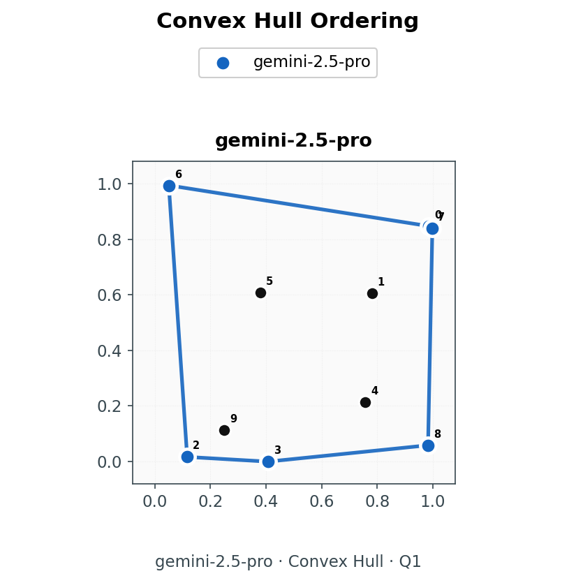
        <figcaption>Gemini 2.5 Pro</figcaption>
      </figure>
      <figure style="flex:1;min-width:280px;margin:0;text-align:center;display:flex;flex-direction:column;align-items:center;">
        
        <figcaption>GPT‑5 (2025‑08‑07)</figcaption>
      </figure>
    </div>
  </details>
</div>

</details>

<details>
<summary>Sample Question 2</summary>

<div style="display:flex;flex-direction:column;gap:14px;margin:12px 0;">
  <details open>
    <summary style="cursor:pointer;font-weight:600;">Question &amp; Prompt</summary>
    <div style="display:flex;gap:16px;flex-wrap:wrap;align-items:flex-start;margin-top:8px;">
      <figure style="flex:1;min-width:260px;margin:0;text-align:center;display:flex;flex-direction:column;align-items:center;">
        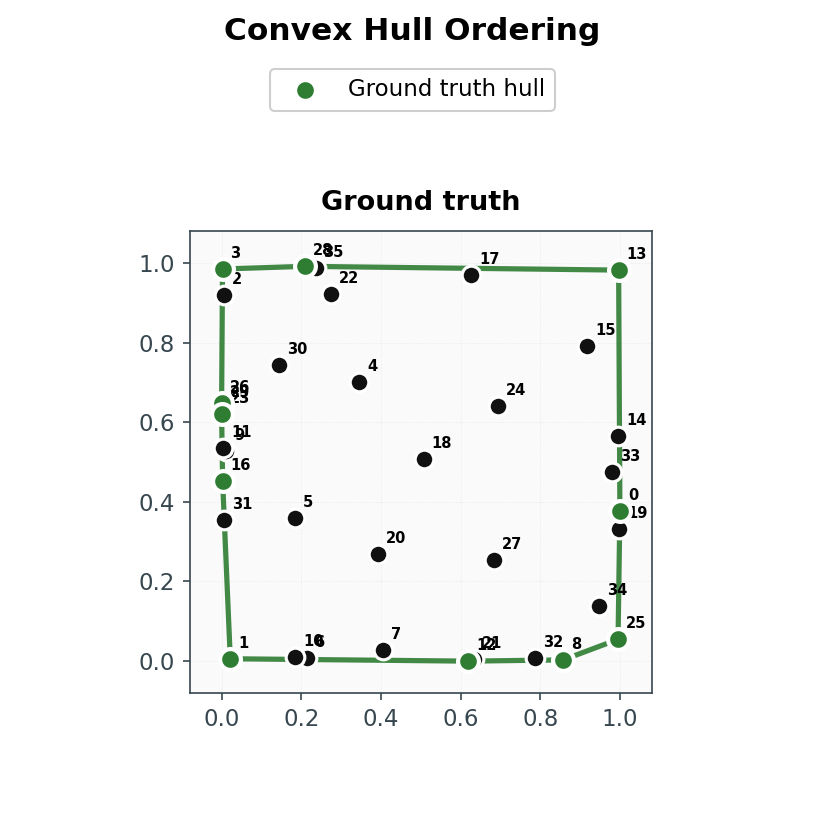
        <figcaption><strong>Question visual/answer</strong></figcaption>
      </figure>
      <pre style="flex:1.5;min-width:320px;max-height:420px;overflow:auto;background:#f9fafb;border:1px solid #e5e7eb;border-radius:6px;padding:12px;font-size:0.9em;line-height:1.35;margin:0;">You are given a set of 2D points (indices correspond to the order shown):
[
[0.9999999999999999, 0.3774788746902663],
[0.021796079009168676, 0.005989281617301664],
[0.006827764985493064, 0.9191721236959333],
[0.002304631877298652, 0.9845929653545332],
[0.3458383119130293, 0.7000792819687283],
[0.1833507382289155, 0.35877702838223346],
[0.21347863456508945, 0.008161433224732357],
[0.40619682604132323, 0.029142835401811756],
[0.8574566753273573, 0.003098650519230135],
[0.011607735622632787, 0.5265324651175397],
[0.18484324985637923, 0.010201526441550793],
[0.004202119773775619, 0.5362014665043575],
[0.6196301643145802, 0.0],
[0.9968482272948653, 0.9818375671902593],
[0.9955560527751108, 0.5643374759068586],
[0.9177312255672199, 0.7904974657941997],
[0.0025424226208299212, 0.45151251523954367],
[0.6272982388018099, 0.9687213253865968],
[0.5073134077666972, 0.5082256885037216],
[0.9985995813620885, 0.33121062053676203],
[0.3928989188053327, 0.2696761513572739],
[0.6345745906331365, 0.005397202262415348],
[0.2754549447741456, 0.9226509984586403],
[0.0, 0.6200508682875664],
[0.6939330806573643, 0.6414582208782306],
[0.9954011583883514, 0.05471632099231117],
[0.0, 0.6481096245403379],
[0.6842570338230184, 0.2545270438959884],
[0.20936538435475496, 0.9912942586959974],
[0.0, 0.6354294045910812],
[0.14400740719553645, 0.7425018205229266],
[0.007161829502783213, 0.35463886199373834],
[0.7872051535291491, 0.008785490976656034],
[0.9800729272659756, 0.47394675290249716],
[0.9483676724534333, 0.13829764991943236],
[0.23573870787159004, 0.9881289901247743]
]

Return the convex hull vertices as a list of integer indices in counterclockwise order.
Start the list at the smallest index among the hull vertices.
Before presenting the final list, begin your response with &lt;thinking&gt;...&lt;/thinking&gt; containing your full chain of thought or reasoning for your answer.
Strict output: a Python list of integers only.</pre>
    </div>
  </details>

  <details>
    <summary style="cursor:pointer;font-weight:600;">Model Answers</summary>
    <div style="display:flex;gap:16px;flex-wrap:nowrap;margin:12px 0;overflow-x:auto;">
      <figure style="flex:1;min-width:280px;margin:0;text-align:center;display:flex;flex-direction:column;align-items:center;">
        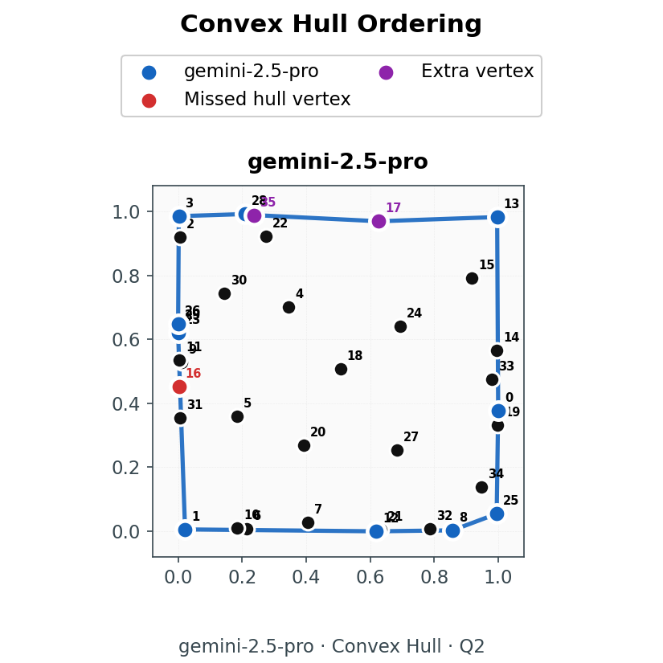
        <figcaption>Gemini 2.5 Pro</figcaption>
      </figure>
      <figure style="flex:1;min-width:280px;margin:0;text-align:center;display:flex;flex-direction:column;align-items:center;">
        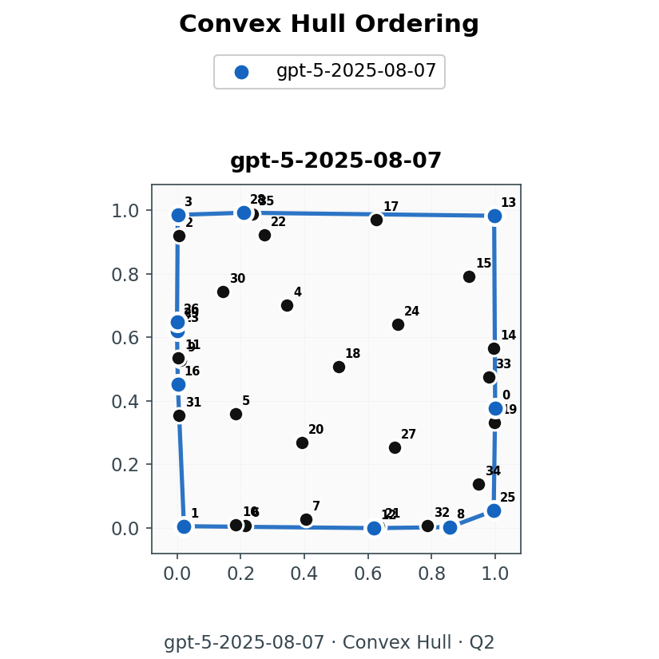
        <figcaption>GPT‑5 (2025‑08‑07)</figcaption>
      </figure>
    </div>
  </details>
</div>

</details>

### Delaunay Triangulation
Partition a point set into triangles satisfying the empty-circle property: no point lies inside any triangle's circumcircle. The constraint is global—each triangle depends on all others—testing whether models grasp metric invariances and maintain combinatorial precision across the entire structure.

<details open>
<summary style="cursor:pointer; font-weight:600;">Sample Question 1</summary>

<div style="display:flex;flex-direction:column;gap:14px;margin:12px 0;">
  <details open>
    <summary style="cursor:pointer;font-weight:600;">Question &amp; Prompt</summary>
    <div style="display:flex;gap:16px;flex-wrap:wrap;align-items:flex-start;margin-top:8px;">
      <figure style="flex:1;min-width:260px;margin:0;text-align:center;display:flex;flex-direction:column;align-items:center;">
        
        <figcaption><strong>Question visual/answer</strong></figcaption>
      </figure>
      <pre style="flex:1.5;min-width:320px;max-height:420px;overflow:auto;background:#f9fafb;border:1px solid #e5e7eb;border-radius:6px;padding:12px;font-size:0.9em;line-height:1.35;margin:0;">You are given a set of 2D points in general position (indices correspond to the order shown):
[
  [0.956, 0.208],
  [0.828, 0.149],
  [0.513, 0.136],
  [0.689, 0.842],
  [0.426, 0.957],
  [0.825, 0.338]
]

Return the Delaunay triangulation as a list of triangles.
Each triangle is a list of three point indices (sorted in ascending order).
Before presenting the final list, begin your response with &lt;thinking&gt;...&lt;/thinking&gt; containing your full chain of thought or reasoning for your answer.
Strict output: a Python list of lists of integers only.</pre>
    </div>
  </details>

  <details>
    <summary style="cursor:pointer;font-weight:600;">Model Answers</summary>
    <div style="display:flex;gap:16px;flex-wrap:nowrap;margin:12px 0;overflow-x:auto;">
      <figure style="flex:1;min-width:280px;margin:0;text-align:center;display:flex;flex-direction:column;align-items:center;">
        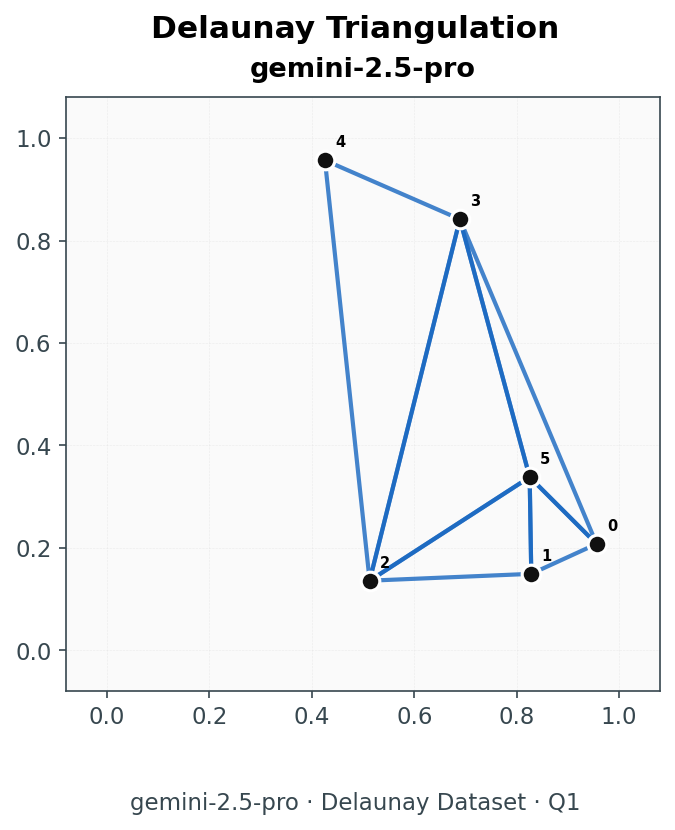
        <figcaption>Gemini 2.5 Pro</figcaption>
      </figure>
      <figure style="flex:1;min-width:280px;margin:0;text-align:center;display:flex;flex-direction:column;align-items:center;">
        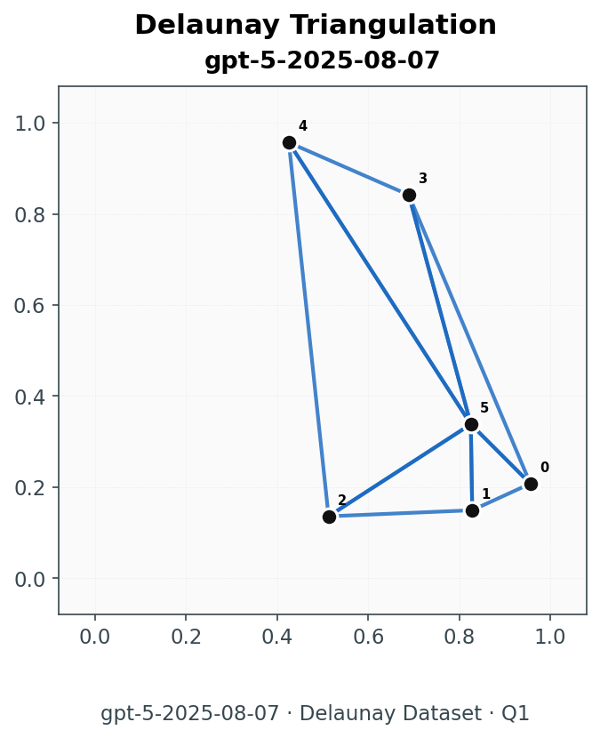
        <figcaption>GPT‑5 (2025‑08‑07)</figcaption>
      </figure>
    </div>
  </details>
</div>

</details>

<details>
<summary>Sample Question 2</summary>

<div style="display:flex;flex-direction:column;gap:14px;margin:12px 0;">
  <details open>
    <summary style="cursor:pointer;font-weight:600;">Question &amp; Prompt</summary>
    <div style="display:flex;gap:16px;flex-wrap:wrap;align-items:flex-start;margin-top:8px;">
      <figure style="flex:1;min-width:260px;margin:0;text-align:center;display:flex;flex-direction:column;align-items:center;">
        
        <figcaption><strong>Question visual/answer</strong></figcaption>
      </figure>
      <pre style="flex:1.5;min-width:320px;max-height:420px;overflow:auto;background:#f9fafb;border:1px solid #e5e7eb;border-radius:6px;padding:12px;font-size:0.9em;line-height:1.35;margin:0;">You are given a set of 2D points in general position (indices correspond to the order shown):
[
  [0.455, 0.263],
  [0.903, 0.671],
  [0.318, 0.878],
  [0.3, 0.2],
  [0.101, 0.649],
  [0.299, 0.918],
  [0.288, 0.22],
  [0.485, 0.548],
  [0.042, 0.058],
  [0.339, 0.635],
  [0.87, 0.842],
  [0.305, 0.399],
  [0.996, 0.435],
  [0.348, 0.315],
  [0.267, 0.662]
]

Return the Delaunay triangulation as a list of triangles.
Each triangle is a list of three point indices (sorted in ascending order).
Before presenting the final list, begin your response with &lt;thinking&gt;...&lt;/thinking&gt; containing your full chain of thought or reasoning for your answer.
Strict output: a Python list of lists of integers only.</pre>
    </div>
  </details>

  <details>
    <summary style="cursor:pointer;font-weight:600;">Model Answers</summary>
    <div style="display:flex;gap:16px;flex-wrap:nowrap;margin:12px 0;overflow-x:auto;">
      <figure style="flex:1;min-width:280px;margin:0;text-align:center;display:flex;flex-direction:column;align-items:center;">
        
        <figcaption>Gemini 2.5 Pro</figcaption>
      </figure>
      <figure style="flex:1;min-width:280px;margin:0;text-align:center;display:flex;flex-direction:column;align-items:center;">
        
        <figcaption>GPT‑5 (2025‑08‑07)</figcaption>
      </figure>
    </div>
  </details>
</div>

</details>

### Topology Enumeration
Which corner labellings of a square force distinct regions to meet inside? Continuous boundaries may curve arbitrarily; only corner labels are observed. Models must enumerate all configurations that guarantee junctions, canonicalised to remove label symmetries.

<details open>
<summary style="cursor:pointer; font-weight:600;">Sample Question 1</summary>

<div style="display:flex;flex-direction:column;gap:14px;margin:12px 0;">
  <details open>
    <summary style="cursor:pointer;font-weight:600;">Question &amp; Prompt</summary>
    <div style="display:flex;gap:16px;flex-wrap:wrap;align-items:flex-start;margin-top:8px;">
      <figure style="flex:1;min-width:260px;margin:0;text-align:center;display:flex;flex-direction:column;align-items:center;">
        
        <figcaption><strong>Question visual/answer</strong></figcaption>
      </figure>
      <pre style="flex:1.5;min-width:320px;max-height:420px;overflow:auto;background:#f9fafb;border:1px solid #e5e7eb;border-radius:6px;padding:12px;font-size:0.9em;line-height:1.35;margin:0;">You are given a unit square with corners ordered (bottom-left, bottom-right, top-right, top-left). Each corner is labeled from {0, 1, 2...}. Boundaries inside may be any continuous curves; only corner labels are observed.

Assume exactly 2 distinct classes occur anywhere in or on the square.

List all corner-label configurations (4-tuples, in the order above) that are sufficient to guarantee that 2 distinct classes meet somewhere inside the square. Canonicalisation: relabel by first occurrence (scan left-to-right; first new label -&gt; 0, next -&gt; 1, ...). Treat any label renamings as identical; list each equivalence class once.

Strict output: a Python-style list of 4-tuples only.</pre>
    </div>
  </details>

  <details>
    <summary style="cursor:pointer;font-weight:600;">Model Answers</summary>
    <div style="display:flex;gap:16px;flex-wrap:nowrap;margin:12px 0;overflow-x:auto;">
      <figure style="flex:1;min-width:280px;margin:0;text-align:center;display:flex;flex-direction:column;align-items:center;">
        
        <figcaption>Gemini 2.5 Pro</figcaption>
      </figure>
      <figure style="flex:1;min-width:280px;margin:0;text-align:center;display:flex;flex-direction:column;align-items:center;">
        
        <figcaption>GPT‑5 (2025‑08‑07)</figcaption>
      </figure>
    </div>
  </details>
</div>

</details>

<details>
<summary>Sample Question 2</summary>

<div style="display:flex;flex-direction:column;gap:14px;margin:12px 0;">
  <details open>
    <summary style="cursor:pointer;font-weight:600;">Question &amp; Prompt</summary>
    <div style="display:flex;gap:16px;flex-wrap:wrap;align-items:flex-start;margin-top:8px;">
      <figure style="flex:1;min-width:260px;margin:0;text-align:center;display:flex;flex-direction:column;align-items:center;">
        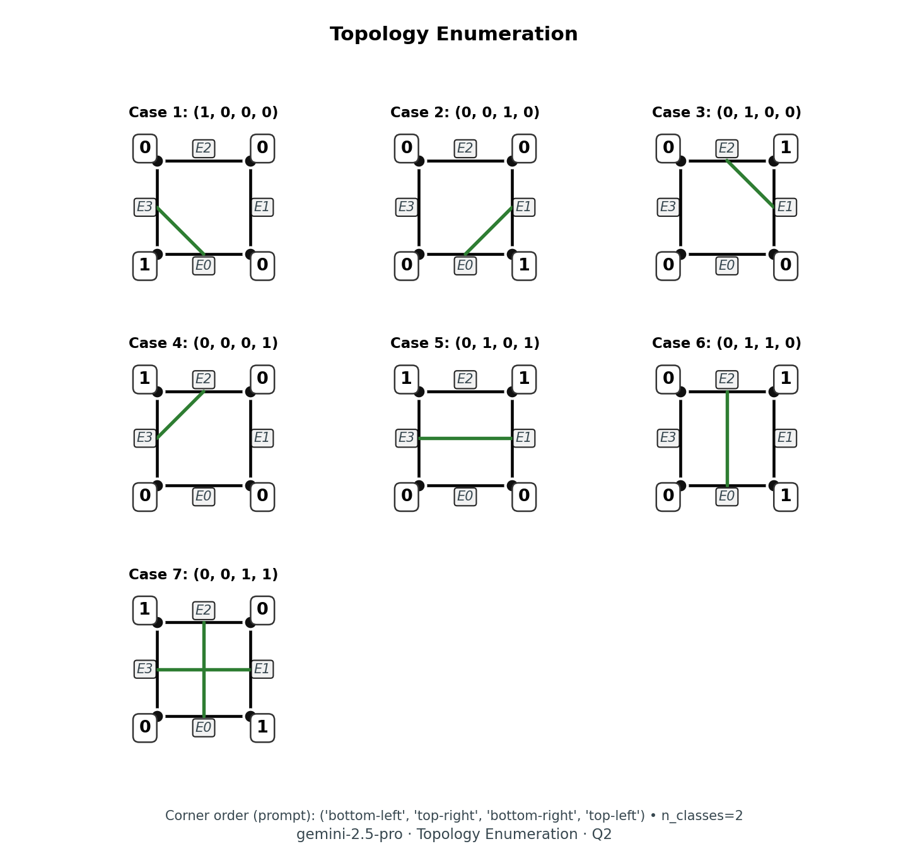
        <figcaption><strong>Question visual/answer</strong></figcaption>
      </figure>
      <pre style="flex:1.5;min-width:320px;max-height:420px;overflow:auto;background:#f9fafb;border:1px solid #e5e7eb;border-radius:6px;padding:12px;font-size:0.9em;line-height:1.35;margin:0;">You are given a unit square with corners ordered (bottom-left, top-right, bottom-right, top-left). Each corner is labeled from {0, 1, 2...}. Boundaries inside may be any continuous curves; only corner labels are observed.

Assume exactly 2 distinct classes occur anywhere in or on the square.

List all corner-label configurations (4-tuples, in the order above) that are sufficient to guarantee that 2 distinct classes meet somewhere inside the square. Canonicalisation: relabel by first occurrence (scan left-to-right; first new label -&gt; 0, next -&gt; 1, ...). Treat any label renamings as identical; list each equivalence class once.

Strict output: a Python-style list of 4-tuples only.</pre>
    </div>
  </details>

  <details>
    <summary style="cursor:pointer;font-weight:600;">Model Answers</summary>
    <div style="display:flex;gap:16px;flex-wrap:nowrap;margin:12px 0;overflow-x:auto;">
      <figure style="flex:1;min-width:280px;margin:0;text-align:center;display:flex;flex-direction:column;align-items:center;">
        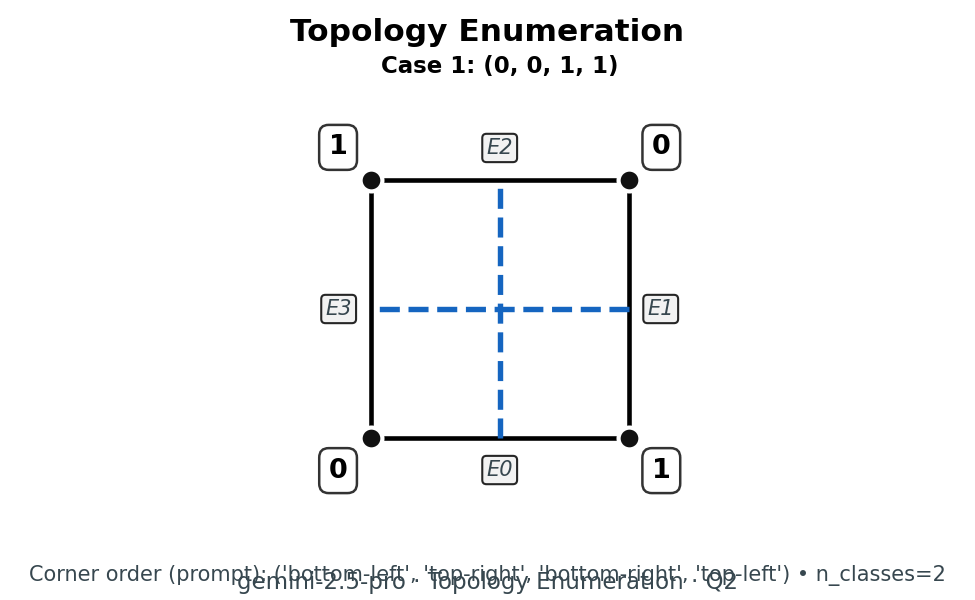
        <figcaption>Gemini 2.5 Pro</figcaption>
      </figure>
      <figure style="flex:1;min-width:280px;margin:0;text-align:center;display:flex;flex-direction:column;align-items:center;">
        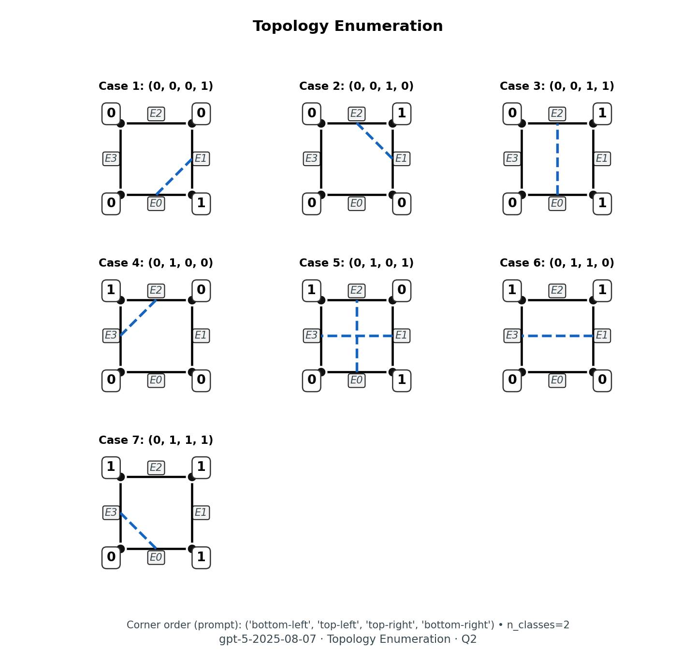
        <figcaption>GPT‑5 (2025‑08‑07)</figcaption>
      </figure>
    </div>
  </details>
</div>

</details>

### Topology Edge Tasks
Given corner labels, which boundary edges must connect through the interior?  
Models infer connectivity from minimal boundary information, handling cases where topology alone cannot determine outcomes.

<details open>
<summary style="cursor:pointer; font-weight:600;">Sample Question 1</summary>

<div style="display:flex;flex-direction:column;gap:14px;margin:12px 0;">
  <details open>
    <summary style="cursor:pointer;font-weight:600;">Question &amp; Prompt</summary>
    <div style="display:flex;gap:16px;flex-wrap:wrap;align-items:flex-start;margin-top:8px;">
      <figure style="flex:1;min-width:260px;margin:0;text-align:center;display:flex;flex-direction:column;align-items:center;">
        
        <figcaption><strong>Question visual/answer</strong></figcaption>
      </figure>
      <pre style="flex:1.5;min-width:320px;max-height:420px;overflow:auto;background:#f9fafb;border:1px solid #e5e7eb;border-radius:6px;padding:12px;font-size:0.9em;line-height:1.35;margin:0;">Squares (each tuple lists the four corner labels; integers denote distinct classes):
(1, 1, 1, 1)
(1, 1, 1, 2)
(1, 1, 2, 1)
(1, 1, 2, 2)

You are given unit squares with corners labelled in ('bottom-left', 'bottom-right', 'top-right', 'top-left') order.
Edges are indexed: bottom=0, right=1, top=2, left=3.

For each square above (in the same order), list which edges are guaranteed to connect.
Return a list where each element is a list of sorted [i,j] pairs (i &lt; j).
If no edges are deterministically guaranteed (including ambiguous cases), return [] for that square.</pre>
    </div>
  </details>

  <details>
    <summary style="cursor:pointer;font-weight:600;">Model Answers</summary>
    <div style="display:flex;gap:16px;flex-wrap:nowrap;margin:12px 0;overflow-x:auto;">
      <figure style="flex:1;min-width:280px;margin:0;text-align:center;display:flex;flex-direction:column;align-items:center;">
        
        <figcaption>Gemini 2.5 Pro</figcaption>
      </figure>
      <figure style="flex:1;min-width:280px;margin:0;text-align:center;display:flex;flex-direction:column;align-items:center;">
        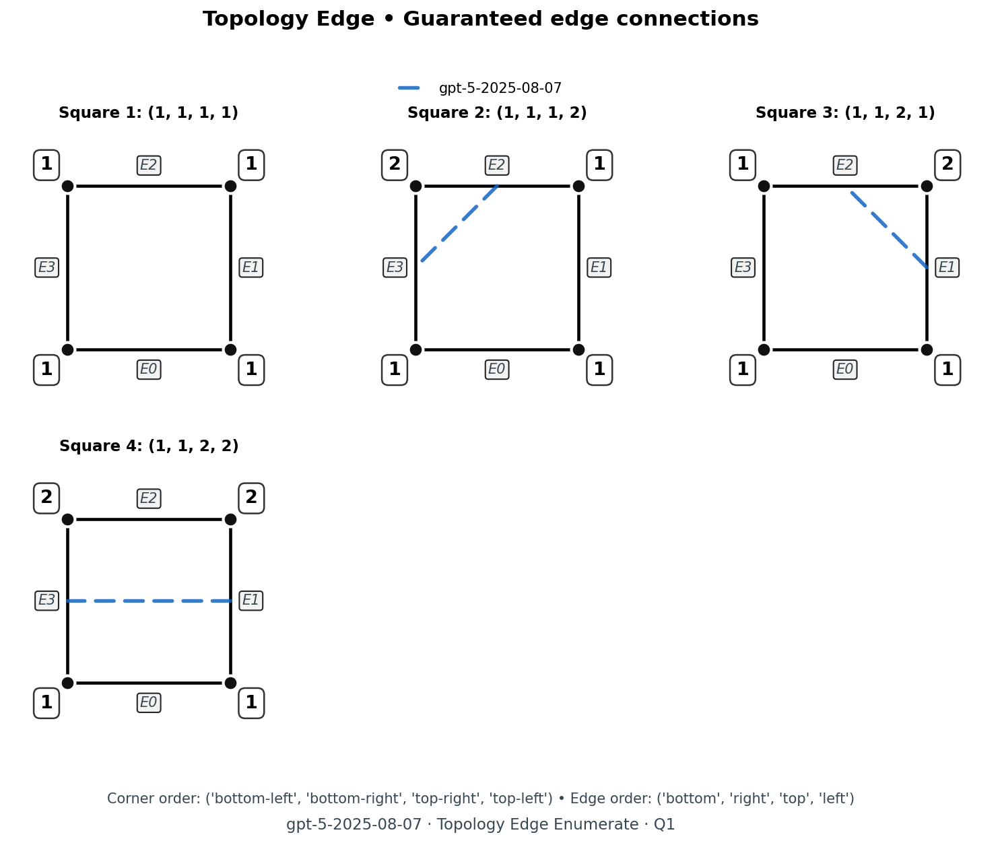
        <figcaption>GPT‑5 (2025‑08‑07)</figcaption>
      </figure>
    </div>
  </details>
</div>

</details>

<details>
<summary>Sample Question 2</summary>

<div style="display:flex;flex-direction:column;gap:14px;margin:12px 0;">
  <details open>
    <summary style="cursor:pointer;font-weight:600;">Question &amp; Prompt</summary>
    <div style="display:flex;gap:16px;flex-wrap:wrap;align-items:flex-start;margin-top:8px;">
      <figure style="flex:1;min-width:260px;margin:0;text-align:center;display:flex;flex-direction:column;align-items:center;">
        
        <figcaption><strong>Question visual/answer</strong></figcaption>
      </figure>
      <pre style="flex:1.5;min-width:320px;max-height:420px;overflow:auto;background:#f9fafb;border:1px solid #e5e7eb;border-radius:6px;padding:12px;font-size:0.9em;line-height:1.35;margin:0;">Squares (each tuple lists the four corner labels; integers denote distinct classes):
(2, 1, 1, 1)
(2, 1, 2, 1)
(2, 1, 3, 1)
(2, 2, 1, 1)
(2, 2, 2, 1)

You are given unit squares with corners labelled in ('bottom-right', 'top-right', 'top-left', 'bottom-left') order.
Edges are indexed: right=0, top=1, left=2, bottom=3.

For each square above (in the same order), list which edges are guaranteed to connect.
Return a list where each element is a list of sorted [i,j] pairs (i &lt; j).
If no edges are deterministically guaranteed (including ambiguous cases), return [] for that square.</pre>
    </div>
  </details>

  <details>
    <summary style="cursor:pointer;font-weight:600;">Model Answers</summary>
    <div style="display:flex;gap:16px;flex-wrap:nowrap;margin:12px 0;overflow-x:auto;">
      <figure style="flex:1;min-width:280px;margin:0;text-align:center;display:flex;flex-direction:column;align-items:center;">
        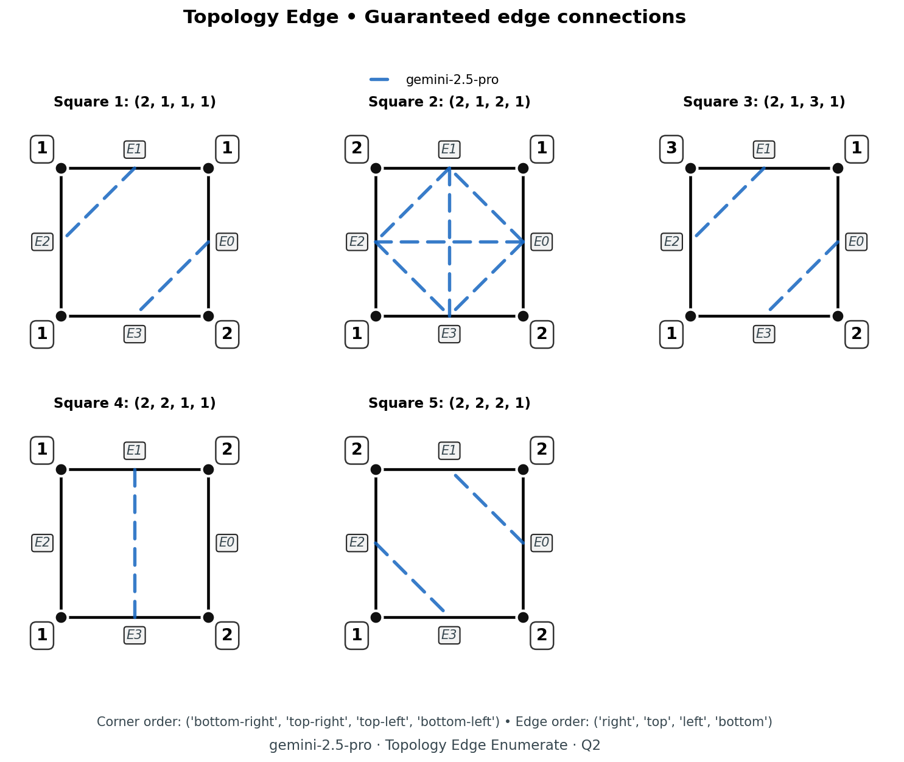
        <figcaption>Gemini 2.5 Pro</figcaption>
      </figure>
      <figure style="flex:1;min-width:280px;margin:0;text-align:center;display:flex;flex-direction:column;align-items:center;">
        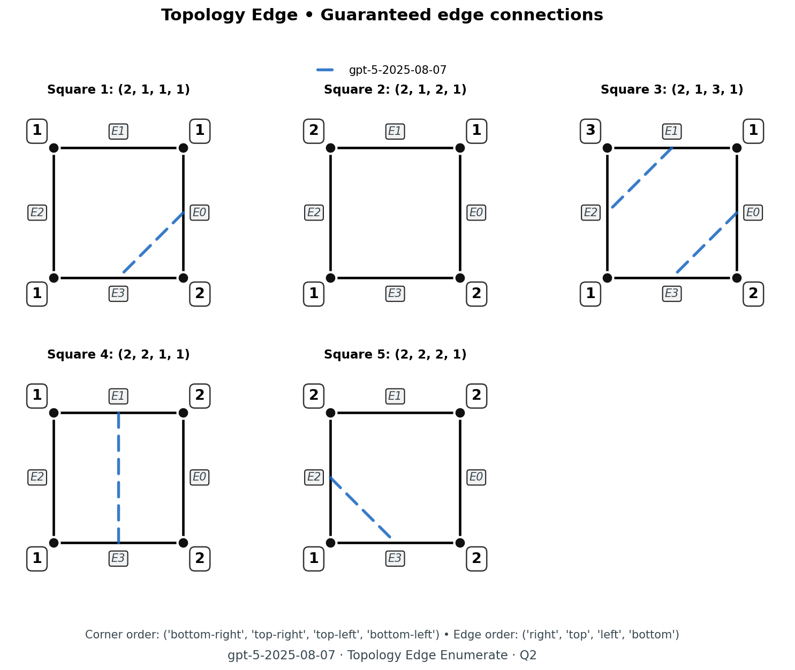
        <figcaption>GPT‑5 (2025‑08‑07)</figcaption>
      </figure>
    </div>
  </details>
</div>

</details>

### Half Subdivision Neighbours
A square or cube is recursively split along axis-aligned planes. Given a target leaf cell, list all adjacent neighbours. The hierarchy is textual; models must track nested containment and compute exact face-sharing in discretised space.

<details open>
<summary style="cursor:pointer; font-weight:600;">Sample Question 1</summary>

<div style="display:flex;flex-direction:column;gap:14px;margin:12px 0;">
  <details open>
    <summary style="cursor:pointer;font-weight:600;">Question &amp; Prompt</summary>
    <div style="display:flex;gap:16px;flex-wrap:wrap;align-items:flex-start;margin-top:8px;">
      <pre style="flex:1;min-width:320px;max-height:420px;overflow:auto;background:#f9fafb;border:1px solid #e5e7eb;border-radius:6px;padding:12px;font-size:0.9em;line-height:1.35;margin:0;">You are given a binary tree describing an axis-aligned half subdivision of the unit cube.

Each node splits its parent cell into two children by bisecting along axes in the repeating cycle z → y → x → x → z (repeating).

Here is the subdivision tree:

```
├── 0
│   ├── 00
│   │   ├── 000
│   │   │   ├── 0000
│   │   │   │   ├── 00000
│   │   │   │   │   ├── 000000
│   │   │   │   │   └── 000001
│   │   │   │   │       ├── 0000010
│   │   │   │   │       │   ├── 00000100
│   │   │   │   │       │   │   ├── 000001000
│   │   │   │   │       │   │   └── 000001001
│   │   │   │   │       │   └── 00000101
│   │   │   │   │       └── 0000011
│   │   │   │   └── 00001
│   │   │   │       ├── 000010
│   │   │   │       └── 000011
│   │   │   │           ├── 0000110
│   │   │   │           └── 0000111
│   │   │   │               ├── 00001110
│   │   │   │               │   ├── 000011100
│   │   │   │               │   └── 000011101
│   │   │   │               └── 00001111
│   │   │   └── 0001
│   │   │       ├── 00010
│   │   │       │   ├── 000100
│   │   │       │   │   ├── 0001000
│   │   │       │   │   │   ├── 00010000
│   │   │       │   │   │   └── 00010001
│   │   │       │   │   └── 0001001
│   │   │       │   │       ├── 00010010
│   │   │       │   │       └── 00010011
│   │   │       │   └── 000101
│   │   │       │       ├── 0001010
│   │   │       │       └── 0001011
│   │   │       └── 00011
│   │   │           ├── 000110
│   │   │           │   ├── 0001100
│   │   │           │   │   ├── 00011000
│   │   │           │   │   └── 00011001
│   │   │           │   │       ├── 000110010
│   │   │           │   │       └── 000110011
│   │   │           │   └── 0001101
│   │   │           │       ├── 00011010
│   │   │           │       │   ├── 000110100
│   │   │           │       │   └── 000110101
│   │   │           │       └── 00011011
│   │   │           └── 000111
│   │   └── 001
│   │       ├── 0010
│   │       │   ├── 00100
│   │       │   │   ├── 001000
│   │       │   │   └── 001001
│   │       │   └── 00101
│   │       │       ├── 001010
│   │       │       └── 001011
│   │       └── 0011
│   │           ├── 00110
│   │           │   ├── 001100
│   │           │   │   ├── 0011000
│   │           │   │   └── 0011001
│   │           │   └── 001101
│   │           └── 00111
│   │               ├── 001110
│   │               └── 001111
│   └── 01
│       ├── 010
│       │   ├── 0100
│       │   │   ├── 01000
│       │   │   │   ├── 010000
│       │   │   │   └── 010001
│       │   │   └── 01001
│       │   │       ├── 010010
│       │   │       └── 010011
│       │   │           ├── 0100110
│       │   │           │   ├── 01001100
│       │   │           │   │   ├── 010011000
│       │   │           │   │   └── 010011001
│       │   │           │   └── 01001101
│       │   │           │       ├── 010011010
│       │   │           │       └── 010011011
│       │   │           └── 0100111
│       │   │               ├── 01001110
│       │   │               │   ├── 010011100
│       │   │               │   └── 010011101
│       │   │               └── 01001111
│       │   │                   ├── 010011110
│       │   │                   └── 010011111
│       │   └── 0101
│       │       ├── 01010
│       │       │   ├── 010100
│       │       │   │   ├── 0101000
│       │       │   │   └── 0101001
│       │       │   └── 010101
│       │       │       ├── 0101010
│       │       │       └── 0101011
│       │       └── 01011
│       │           ├── 010110
│       │           │   ├── 0101100
│       │           │   └── 0101101
│       │           └── 010111
│       │               ├── 0101110
│       │               │   ├── 01011100
│       │               │   └── 01011101
│       │               └── 0101111
│       └── 011
│           ├── 0110
│           │   ├── 01100
│           │   │   ├── 011000
│           │   │   └── 011001
│           │   └── 01101
│           │       ├── 011010
│           │       └── 011011
│           └── 0111
│               ├── 01110
│               │   ├── 011100
│               │   └── 011101
│               └── 01111
│                   ├── 011110
│                   └── 011111
└── 1
    ├── 10
    │   ├── 100
    │   │   ├── 1000
    │   │   │   ├── 10000
    │   │   │   │   ├── 100000
    │   │   │   │   └── 100001
    │   │   │   └── 10001
    │   │   │       ├── 100010
    │   │   │       └── 100011
    │   │   └── 1001
    │   │       ├── 10010
    │   │       │   ├── 100100
    │   │       │   │   ├── 1001000
    │   │       │   │   └── 1001001
    │   │       │   └── 100101
    │   │       └── 10011
    │   │           ├── 100110
    │   │           │   ├── 1001100
    │   │           │   └── 1001101
    │   │           └── 100111
    │   │               ├── 1001110
    │   │               └── 1001111
    │   └── 101
    │       ├── 1010
    │       │   ├── 10100
    │       │   │   ├── 101000
    │       │   │   └── 101001
    │       │   └── 10101
    │       │       ├── 101010
    │       │       └── 101011
    │       └── 1011
    │           ├── 10110
    │           │   ├── 101100
    │           │   └── 101101
    │           └── 10111
    │               ├── 101110
    │               └── 101111
    └── 11
        ├── 110
        │   ├── 1100
        │   │   ├── 11000
        │   │   │   ├── 110000
        │   │   │   └── 110001
        │   │   └── 11001
        │   │       ├── 110010
        │   │       └── 110011
        │   └── 1101
        │       ├── 11010
        │       │   ├── 110100
        │       │   └── 110101
        │       └── 11011
        │           ├── 110110
        │           └── 110111
        └── 111
            ├── 1110
            │   ├── 11100
            │   │   ├── 111000
            │   │   └── 111001
            │   └── 11101
            │       ├── 111010
            │       └── 111011
            └── 1111
                ├── 11110
                │   ├── 111100
                │   └── 111101
                └── 11111
                    ├── 111110
                    └── 111111
```

Target leaf: 000111

Before presenting the final list, begin your response with &lt;thinking&gt;...&lt;/thinking&gt; containing your full chain of thought or reasoning for your answer.
List every leaf that shares a face with the target voxel. Return the labels as a comma-separated list of strings (quotes optional).</pre>
    </div>
  </details>

  <details>
    <summary style="cursor:pointer;font-weight:600;">Model Answers</summary>
    <div style="display:flex;gap:16px;flex-wrap:nowrap;margin:12px 0;overflow-x:auto;">
      <figure style="flex:1;min-width:280px;margin:0;text-align:center;display:flex;flex-direction:column;align-items:center;">
        <div style="width:100%;border:1px dashed #d1d5db;margin:0 0 8px;padding:28px 16px;font-style:italic;color:#6b7280;text-align:center;">Pending render</div>
        <figcaption>Gemini 2.5 Pro</figcaption>
      </figure>
      <figure style="flex:1;min-width:280px;margin:0;text-align:center;display:flex;flex-direction:column;align-items:center;">
        
        <figcaption>GPT‑5 (2025‑08‑07)</figcaption>
      </figure>
    </div>
  </details>
</div>

</details>

<details>
<summary>Sample Question 2</summary>

<div style="display:flex;flex-direction:column;gap:14px;margin:12px 0;">
  <details open>
    <summary style="cursor:pointer;font-weight:600;">Question &amp; Prompt</summary>
    <div style="display:flex;gap:16px;flex-wrap:wrap;align-items:flex-start;margin-top:8px;">
      <pre style="flex:1;min-width:320px;max-height:420px;overflow:auto;background:#f9fafb;border:1px solid #e5e7eb;border-radius:6px;padding:12px;font-size:0.9em;line-height:1.35;margin:0;">You are given a binary tree describing an axis-aligned half subdivision of the unit cube.

Each node splits its parent cell into two children by bisecting along axes in the repeating cycle x → x → y → z (repeating).

Here is the subdivision tree:

```
├── 0
│   ├── 00
│   │   ├── 000
│   │   │   ├── 0000
│   │   │   │   ├── 00000
│   │   │   │   │   ├── 000000
│   │   │   │   │   └── 000001
│   │   │   │   └── 00001
│   │   │   │       ├── 000010
│   │   │   │       └── 000011
│   │   │   └── 0001
│   │   │       ├── 00010
│   │   │       │   ├── 000100
│   │   │       │   └── 000101
│   │   │       └── 00011
│   │   │           ├── 000110
│   │   │           └── 000111
│   │   └── 001
│   │       ├── 0010
│   │       │   ├── 00100
│   │       │   │   ├── 001000
│   │       │   │   └── 001001
│   │       │   └── 00101
│   │       │       ├── 001010
│   │       │       └── 001011
│   │       └── 0011
│   │           ├── 00110
│   │           │   ├── 001100
│   │           │   └── 001101
│   │           └── 00111
│   │               ├── 001110
│   │               └── 001111
│   └── 01
│       ├── 010
│       │   ├── 0100
│       │   │   ├── 01000
│       │   │   │   ├── 010000
│       │   │   │   └── 010001
│       │   │   └── 01001
│       │   │       ├── 010010
│       │   │       └── 010011
│       │   └── 0101
│       │       ├── 01010
│       │       │   ├── 010100
│       │       │   └── 010101
│       │       └── 01011
│       │           ├── 010110
│       │           └── 010111
│       └── 011
│           ├── 0110
│           │   ├── 01100
│           │   │   ├── 011000
│           │   │   └── 011001
│           │   └── 01101
│           │       ├── 011010
│           │       └── 011011
│           └── 0111
│               ├── 01110
│               │   ├── 011100
│               │   └── 011101
│               └── 01111
│                   ├── 011110
│                   └── 011111
└── 1
    ├── 10
    │   ├── 100
    │   │   ├── 1000
    │   │   │   ├── 10000
    │   │   │   │   ├── 100000
    │   │   │   │   └── 100001
    │   │   │   └── 10001
    │   │   │       ├── 100010
    │   │   │       └── 100011
    │   │   └── 1001
    │   │       ├── 10010
    │   │       │   ├── 100100
    │   │       │   └── 100101
    │   │       └── 10011
    │   │           ├── 100110
    │   │           └── 100111
    │   └── 101
    │       ├── 1010
    │       │   ├── 10100
    │       │   │   ├── 101000
    │       │   │   └── 101001
    │       │   └── 10101
    │       │       ├── 101010
    │       │       └── 101011
    │       └── 1011
    │           ├── 10110
    │           │   ├── 101100
    │           │   └── 101101
    │           └── 10111
    │               ├── 101110
    │               └── 101111
    └── 11
        ├── 110
        │   ├── 1100
        │   │   ├── 11000
        │   │   │   ├── 110000
        │   │   │   └── 110001
        │   │   └── 11001
        │   │       ├── 110010
        │   │       └── 110011
        │   └── 1101
        │       ├── 11010
        │       │   ├── 110100
        │       │   └── 110101
        │       └── 11011
        │           ├── 110110
        │           └── 110111
        └── 111
            ├── 1110
            │   ├── 11100
            │   │   ├── 111000
            │   │   └── 111001
            │   └── 11101
            │       ├── 111010
            │       └── 111011
            └── 1111
                ├── 11110
                │   ├── 111100
                │   └── 111101
                └── 11111
                    ├── 111110
                    └── 111111
```

Target leaf: 000111

Before presenting the final list, begin your response with &lt;thinking&gt;...&lt;/thinking&gt; containing your full chain of thought or reasoning for your answer.
List every leaf that shares a face with the target voxel. Return the labels as a comma-separated list of strings (quotes optional).</pre>
    </div>
  </details>

  <details>
    <summary style="cursor:pointer;font-weight:600;">Model Answers</summary>
    <div style="display:flex;gap:16px;flex-wrap:nowrap;margin:12px 0;overflow-x:auto;">
      <figure style="flex:1;min-width:280px;margin:0;text-align:center;display:flex;flex-direction:column;align-items:center;">
        
        <figcaption>Gemini 2.5 Pro</figcaption>
      </figure>
      <figure style="flex:1;min-width:280px;margin:0;text-align:center;display:flex;flex-direction:column;align-items:center;">
        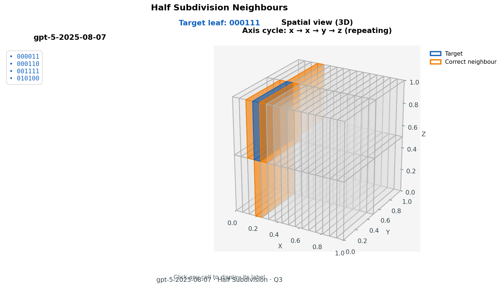
        <figcaption>GPT‑5 (2025‑08‑07)</figcaption>
      </figure>
    </div>
  </details>
</div>

</details>

### Shikaku Rectangles
Partition a grid into rectangles such that each contains exactly one number equal to its area. Constraints are local (area match) and global (full coverage, no gaps). Models must satisfy both simultaneously through spatial planning.

<details open>
<summary style="cursor:pointer; font-weight:600;">Sample Question 1</summary>

<div style="display:flex;flex-direction:column;gap:14px;margin:12px 0;">
  <details open>
    <summary style="cursor:pointer;font-weight:600;">Question &amp; Prompt</summary>
    <div style="display:flex;gap:16px;flex-wrap:wrap;align-items:flex-start;margin-top:8px;">
      <figure style="flex:1;min-width:260px;margin:0;text-align:center;display:flex;flex-direction:column;align-items:center;">
        
        <figcaption><strong>Question visual/answer</strong></figcaption>
      </figure>
      <pre style="flex:1.5;min-width:320px;max-height:420px;overflow:auto;background:#f9fafb;border:1px solid #e5e7eb;border-radius:6px;padding:12px;font-size:0.9em;line-height:1.35;margin:0;">Solve the Shikaku puzzle on a 7×7 grid.
Cells contain numbers indicating the area of the rectangle that must cover them;
all blank cells are denoted by 0.
Grid (rows listed top to bottom, values space-separated):
3 0 8 0 0 0 0
0 0 0 0 0 0 2
0 0 0 0 4 0 4
0 4 0 3 0 3 0
0 3 0 0 0 0 0
4 0 0 4 2 0 0
0 2 0 0 0 0 3

Return the solution as a Python list of bounding boxes.
Each rectangle must be [left_col, top_row, right_col, bottom_row] using 0-indexed inclusive coordinates.
Rectangles must exactly partition the grid and each must contain exactly one clue equal to its area.
Before presenting the final list, begin your response with &lt;thinking&gt;...&lt;/thinking&gt; containing your full chain of thought or reasoning for your answer.</pre>
    </div>
  </details>

  <details>
    <summary style="cursor:pointer;font-weight:600;">Model Answers</summary>
    <div style="display:flex;gap:16px;flex-wrap:nowrap;margin:12px 0;overflow-x:auto;">
      <figure style="flex:1;min-width:280px;margin:0;text-align:center;display:flex;flex-direction:column;align-items:center;">
        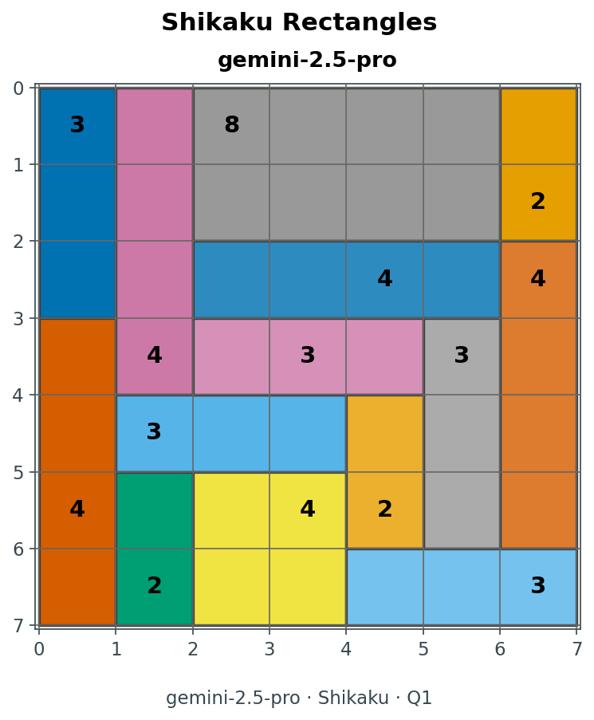
        <figcaption>Gemini 2.5 Pro</figcaption>
      </figure>
      <figure style="flex:1;min-width:280px;margin:0;text-align:center;display:flex;flex-direction:column;align-items:center;">
        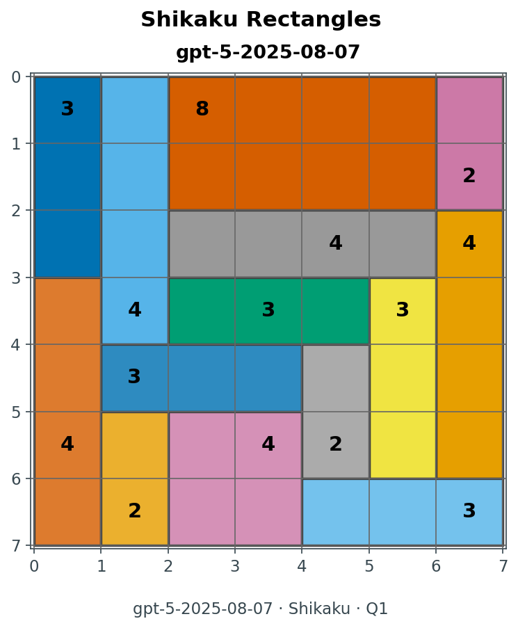
        <figcaption>GPT‑5 (2025‑08‑07)</figcaption>
      </figure>
    </div>
  </details>
</div>

</details>

<details>
<summary>Sample Question 2</summary>

<div style="display:flex;flex-direction:column;gap:14px;margin:12px 0;">
  <details open>
    <summary style="cursor:pointer;font-weight:600;">Question &amp; Prompt</summary>
    <div style="display:flex;gap:16px;flex-wrap:wrap;align-items:flex-start;margin-top:8px;">
      <figure style="flex:1;min-width:260px;margin:0;text-align:center;display:flex;flex-direction:column;align-items:center;">
        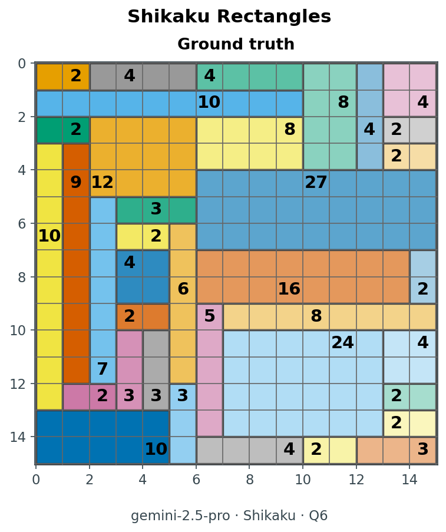
        <figcaption><strong>Question visual/answer</strong></figcaption>
      </figure>
      <pre style="flex:1.5;min-width:320px;max-height:420px;overflow:auto;background:#f9fafb;border:1px solid #e5e7eb;border-radius:6px;padding:12px;font-size:0.9em;line-height:1.35;margin:0;">Solve the Shikaku puzzle on a 15×15 grid.
Cells contain numbers indicating the area of the rectangle that must cover them;
all blank cells are denoted by 0.
Grid (rows listed top to bottom, values space-separated):
0 2 0 4 0 0 4 0 0 0 0 0 0 0 0
0 0 0 0 0 0 10 0 0 0 0 8 0 0 4
0 2 0 0 0 0 0 0 0 8 0 0 4 2 0
0 0 0 0 0 0 0 0 0 0 0 0 0 2 0
0 9 12 0 0 0 0 0 0 0 27 0 0 0 0
0 0 0 0 3 0 0 0 0 0 0 0 0 0 0
10 0 0 0 2 0 0 0 0 0 0 0 0 0 0
0 0 0 4 0 0 0 0 0 0 0 0 0 0 0
0 0 0 0 0 6 0 0 0 16 0 0 0 0 2
0 0 0 2 0 0 5 0 0 0 8 0 0 0 0
0 0 0 0 0 0 0 0 0 0 0 24 0 0 4
0 0 7 0 0 0 0 0 0 0 0 0 0 0 0
0 0 2 3 3 3 0 0 0 0 0 0 0 2 0
0 0 0 0 0 0 0 0 0 0 0 0 0 2 0
0 0 0 0 10 0 0 0 0 4 2 0 0 0 3

Return the solution as a Python list of bounding boxes.
Each rectangle must be [left_col, top_row, right_col, bottom_row] using 0-indexed inclusive coordinates.
Rectangles must exactly partition the grid and each must contain exactly one clue equal to its area.
Before presenting the final list, begin your response with &lt;thinking&gt;...&lt;/thinking&gt; containing your full chain of thought or reasoning for your answer.</pre>
    </div>
  </details>

  <details>
    <summary style="cursor:pointer;font-weight:600;">Model Answers</summary>
    <div style="display:flex;gap:16px;flex-wrap:nowrap;margin:12px 0;overflow-x:auto;">
      <figure style="flex:1;min-width:280px;margin:0;text-align:center;display:flex;flex-direction:column;align-items:center;">
        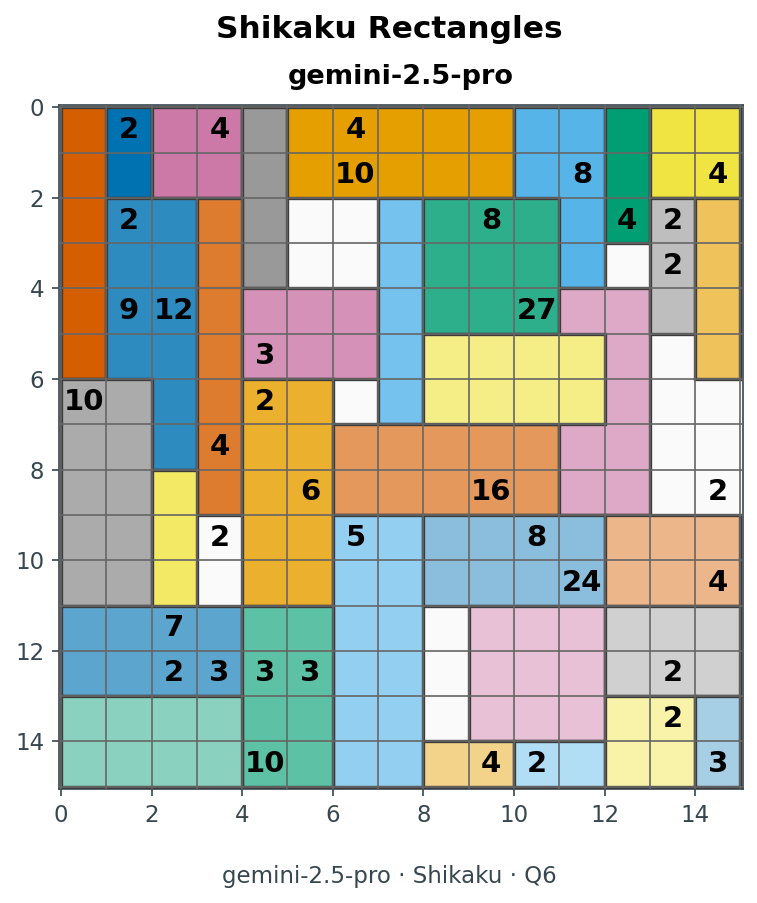
        <figcaption>Gemini 2.5 Pro</figcaption>
      </figure>
      <figure style="flex:1;min-width:280px;margin:0;text-align:center;display:flex;flex-direction:column;align-items:center;">
        
        <figcaption>GPT‑5 (2025‑08‑07)</figcaption>
      </figure>
    </div>
  </details>
</div>

</details>

### Two Segments
Place two straight segments inside a square to create a specified mix of triangles, quadrilaterals, pentagons, and hexagons. Endpoints must lie on the boundary. Models must construct valid geometric solutions to combinatorial constraints, balancing feasibility with target counts.

<details open>
<summary style="cursor:pointer; font-weight:600;">Sample Question 1</summary>

<div style="display:flex;flex-direction:column;gap:14px;margin:12px 0;">
  <details open>
    <summary style="cursor:pointer;font-weight:600;">Question &amp; Prompt</summary>
    <div style="display:flex;gap:16px;flex-wrap:wrap;align-items:flex-start;margin-top:8px;">
      <pre style="flex:1;min-width:320px;max-height:420px;overflow:auto;background:#f9fafb;border:1px solid #e5e7eb;border-radius:6px;padding:12px;font-size:0.9em;line-height:1.35;margin:0;">Work inside the square whose boundary corners (in order) are (0.0203904, 0.137524), (0.797794, 0.137524), (0.797794, 0.914927), (0.0203904, 0.914927).
Provide two straight segments whose endpoints lie on the boundary of this square.
The two segments together with the square&#x27;s edges must partition the interior into exactly 1 triangle, 1 quadrilateral, and 1 pentagon.
Before presenting the final list, begin your response with &lt;thinking&gt;...&lt;/thinking&gt; containing your full chain of thought or reasoning for your answer.
Return a Python list of the two segments in the form [((x0, y0), (x1, y1)), ((x2, y2), (x3, y3))].</pre>
    </div>
  </details>

  <details>
    <summary style="cursor:pointer;font-weight:600;">Model Answers</summary>
    <div style="display:flex;gap:16px;flex-wrap:nowrap;margin:12px 0;overflow-x:auto;">
      <figure style="flex:1;min-width:280px;margin:0;text-align:center;display:flex;flex-direction:column;align-items:center;">
        
        <figcaption>Gemini 2.5 Pro</figcaption>
      </figure>
      <figure style="flex:1;min-width:280px;margin:0;text-align:center;display:flex;flex-direction:column;align-items:center;">
        
        <figcaption>GPT‑5 (2025‑08‑07)</figcaption>
      </figure>
    </div>
  </details>
</div>

</details>

<details>
<summary>Sample Question 2</summary>

<div style="display:flex;flex-direction:column;gap:14px;margin:12px 0;">
  <details open>
    <summary style="cursor:pointer;font-weight:600;">Question &amp; Prompt</summary>
    <div style="display:flex;gap:16px;flex-wrap:wrap;align-items:flex-start;margin-top:8px;">
      <pre style="flex:1;min-width:320px;max-height:420px;overflow:auto;background:#f9fafb;border:1px solid #e5e7eb;border-radius:6px;padding:12px;font-size:0.9em;line-height:1.35;margin:0;">Work inside the square whose boundary corners (in order) are (0, 0), (1.25, 0.05), (1.1, 1.15), (-0.1, 1).
Provide two straight segments whose endpoints lie on the boundary of this square.
The two segments together with the square&#x27;s edges must partition the interior into exactly 2 triangles, 1 quadrilateral, and 1 hexagon.
Before presenting the final list, begin your response with &lt;thinking&gt;...&lt;/thinking&gt; containing your full chain of thought or reasoning for your answer.
Return a Python list of the two segments in the form [((x0, y0), (x1, y1)), ((x2, y2), (x3, y3))].</pre>
    </div>
  </details>

  <details>
    <summary style="cursor:pointer;font-weight:600;">Model Answers</summary>
    <div style="display:flex;gap:16px;flex-wrap:nowrap;margin:12px 0;overflow-x:auto;">
      <figure style="flex:1;min-width:280px;margin:0;text-align:center;display:flex;flex-direction:column;align-items:center;">
        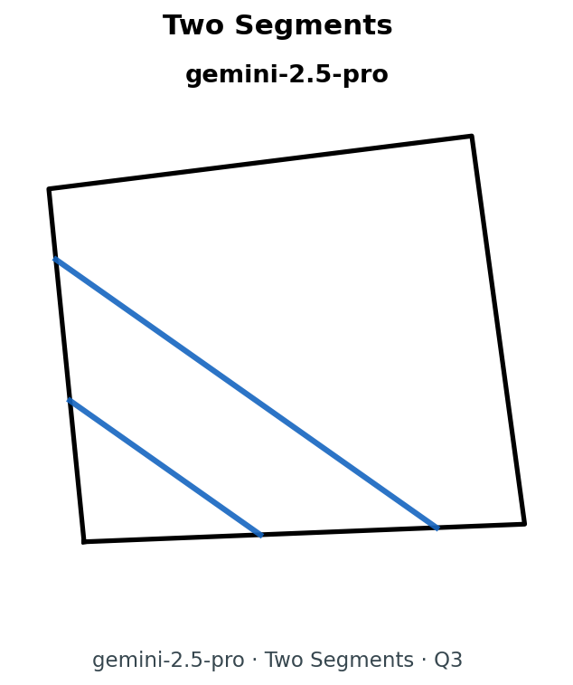
        <figcaption>Gemini 2.5 Pro</figcaption>
      </figure>
      <figure style="flex:1;min-width:280px;margin:0;text-align:center;display:flex;flex-direction:column;align-items:center;">
        
        <figcaption>GPT‑5 (2025‑08‑07)</figcaption>
      </figure>
    </div>
  </details>
</div>

</details>

---

## Results

We evaluated both models on **36 questions** across seven distinct geometric reasoning tasks:

| Task | Questions |
|------|-----------|
| Convex Hull Ordering | 6 |
| Delaunay Triangulation | 5 |
| Half Subdivision Neighbours | 7 |
| Shikaku Rectangles | 6 |
| Topology Edge Enumeration | 3 |
| Topology Enumeration | 5 |
| Two Segments | 4 |

The performance metrics shown below compare Gemini 2.5 Pro and GPT-5 (2025-08-07) across these tasks, revealing the challenges that frontier models face in spatial reasoning without visual input.

<div style="display:flex;gap:16px;flex-wrap:nowrap;margin:12px 0;overflow-x:auto;">
  <figure style="flex:1;min-width:400px;margin:0;text-align:center;display:flex;flex-direction:column;align-items:center;">
    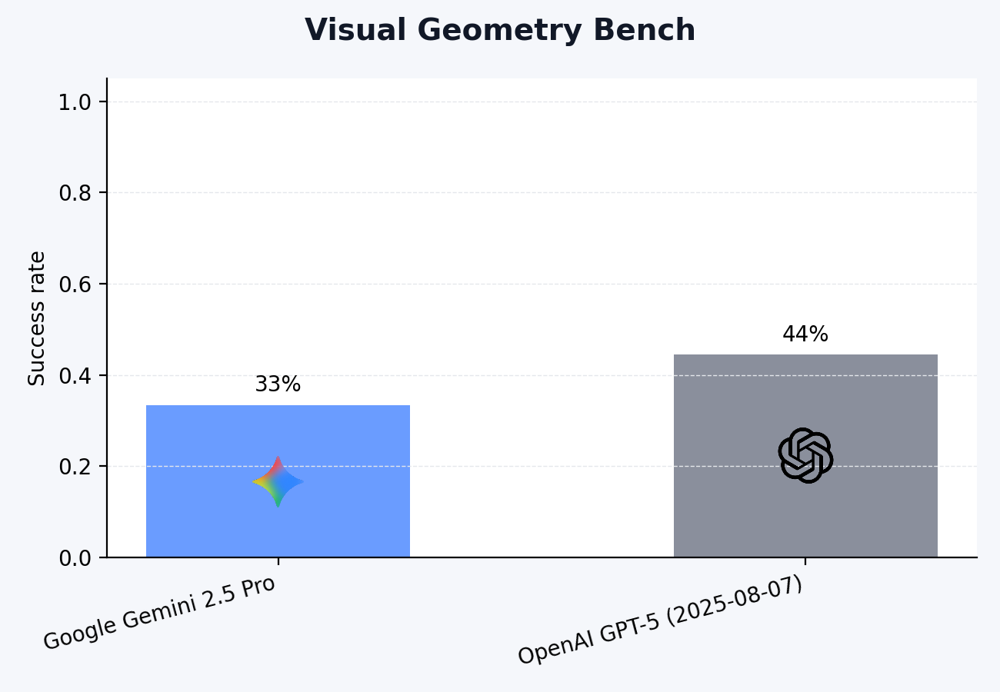
    <figcaption style="font-size:0.9em;color:#666;">Overall Performance Across Tasks</figcaption>
  </figure>
  <figure style="flex:1;min-width:400px;margin:0;text-align:center;display:flex;flex-direction:column;align-items:center;">
    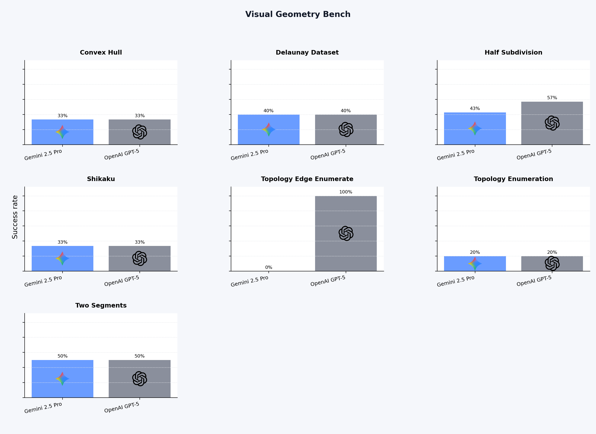
    <figcaption style="font-size:0.9em;color:#666;">Performance Breakdown by Task</figcaption>
  </figure>
</div>

## Narrative

- Visual and topological reasoning through multiple steps
- Questions which naturally force you to draw and visually solve, even though theoretically it can be solved analytically.
- Gather how these models would exploit and solve tasks which necessarily require humans to visualise and draw.

- Another spin?
    - We are measuring geometric intuition. And then stress testing it.
    

Interesting questions to show:
- change of configurations: breaking of pattern leads to spending more deliberate attention.
    - in corner configurations of N domains meeting in quad.
    - in axis configurations of half subdivision.
- This leads to a few open questions:
    - How is attention spent?
        - Is there an ablation here for different kind of attention spending mechanisms like sparse, ring, etc?
        - Can we teach the model to intentionally spend more attention on certain tasks? 
