# Abstract

Visual Geometry Bench measures LLM spatial cognition through questions that compel humans to visualise in order to solve, aka test the "Geometric Intuition".
We probe how models reconstruct global structure from fragments, reason across spatial hierarchies, and infer topological relationships, all without visual input.

## Tasks

### Convex Hull Ordering
Given scattered 2D points, identify which lie on the convex boundary and order them counter-clockwise. Points cluster near edges to stress global shape recovery amidst local clutter. Models must distinguish boundary from interior and maintain rotational consistency.

<table>
  <tr>
    <td style="text-align:center;">
      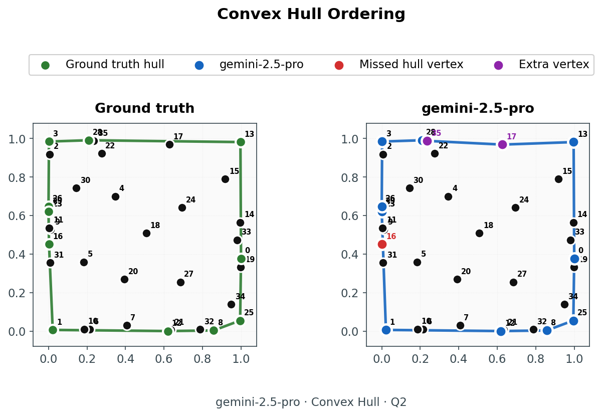 
      Gemini 2.5 Pro
    </td>
    <td style="text-align:center;">
      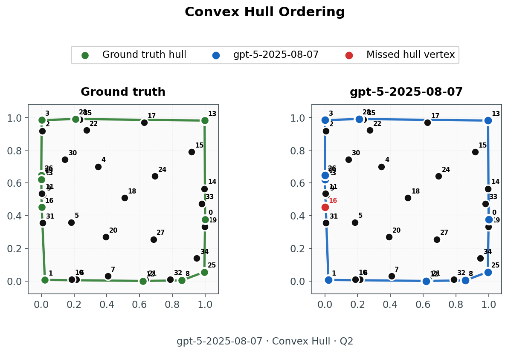 
      GPT‑5 (2025‑08‑07)
    </td>
  </tr>
</table>

### Delaunay Triangulation
Partition a point set into triangles satisfying the empty-circle property: no point lies inside any triangle's circumcircle. The constraint is global—each triangle depends on all others—testing whether models grasp metric invariances and maintain combinatorial precision across the entire structure.

<table>
  <tr>
    <td style="text-align:center;">
      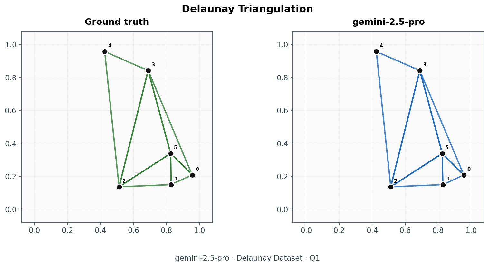 
      Gemini 2.5 Pro
    </td>
    <td style="text-align:center;">
      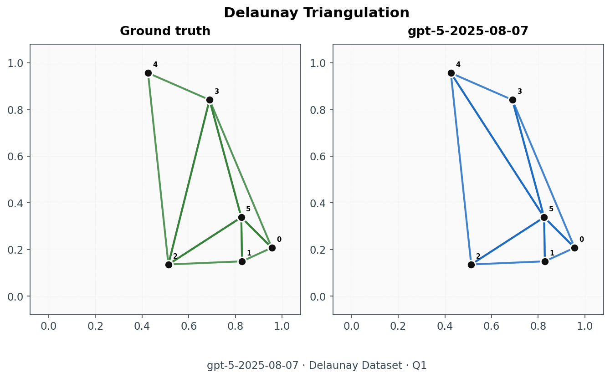 
      GPT‑5 (2025‑08‑07)
    </td>
  </tr>
</table>

### Topology Enumeration
Which corner labellings of a square force distinct regions to meet inside? Continuous boundaries may curve arbitrarily; only corner labels are observed. Models must enumerate all configurations that guarantee junctions, canonicalised to remove label symmetries.

<table>
  <tr>
    <td style="text-align:center;">
      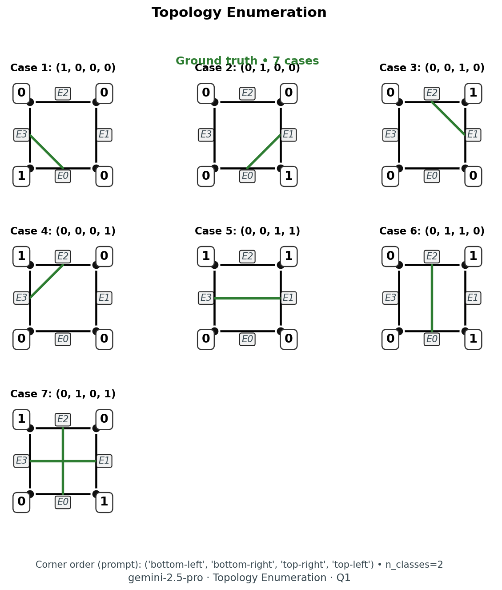 
      Gemini 2.5 Pro
    </td>
    <td style="text-align:center;">
       
      GPT‑5 (2025‑08‑07)
    </td>
  </tr>
</table>

### Topology Edge Tasks
**Enumerate edges**: Given corner labels, which boundary edges must connect through the interior?  

Models infer connectivity from minimal boundary information, handling cases where topology alone cannot determine outcomes.

<table>
  <tr>
    <td style="text-align:center;">
      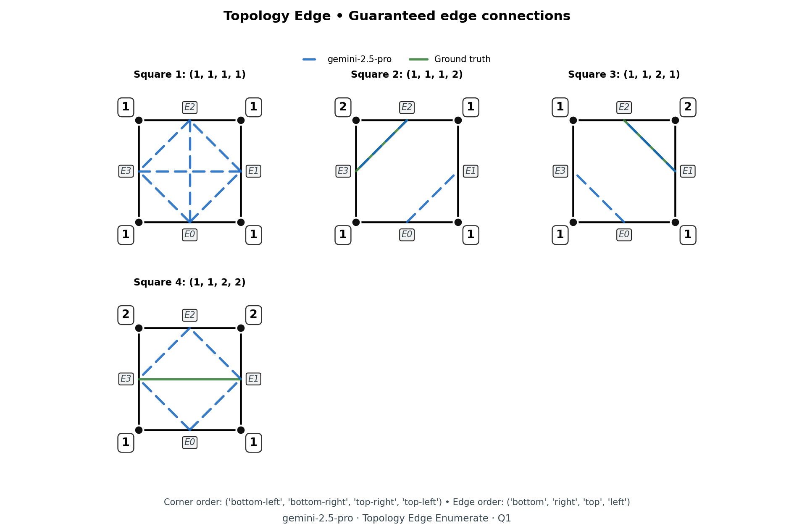 
      Gemini 2.5 Pro
    </td>
    <td style="text-align:center;">
      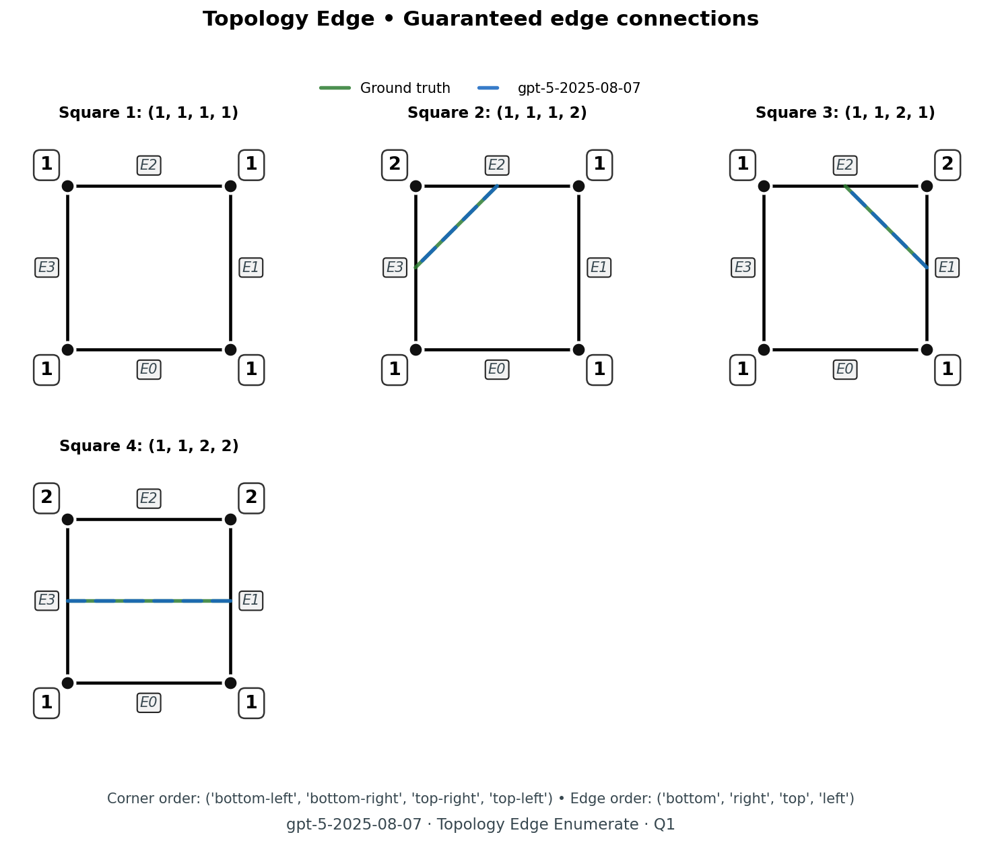 
      GPT‑5 (2025‑08‑07)
    </td>
  </tr>
</table>

### Half Subdivision Neighbours
A square or cube is recursively split along axis-aligned planes. Given a target leaf cell, list all adjacent neighbours. The hierarchy is textual; models must track nested containment and compute exact face-sharing in discretised space.

<table>
  <tr>
    <td style="text-align:center;">
      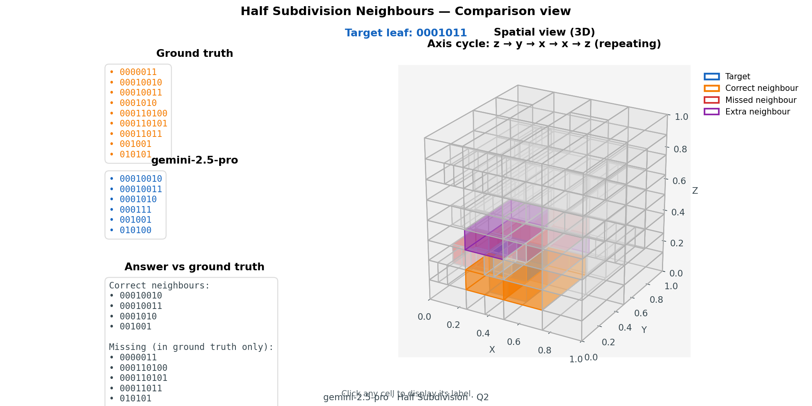 
      Gemini 2.5 Pro
    </td>
    <td style="text-align:center;">
      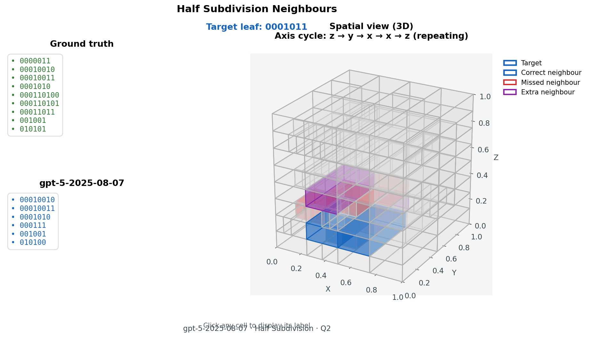 
      GPT‑5 (2025‑08‑07)
    </td>
  </tr>
</table>

### Shikaku Rectangles
Partition a grid into rectangles such that each contains exactly one number equal to its area. Constraints are local (area match) and global (full coverage, no gaps). Models must satisfy both simultaneously through spatial planning.

<table>
  <tr>
    <td style="text-align:center;">
      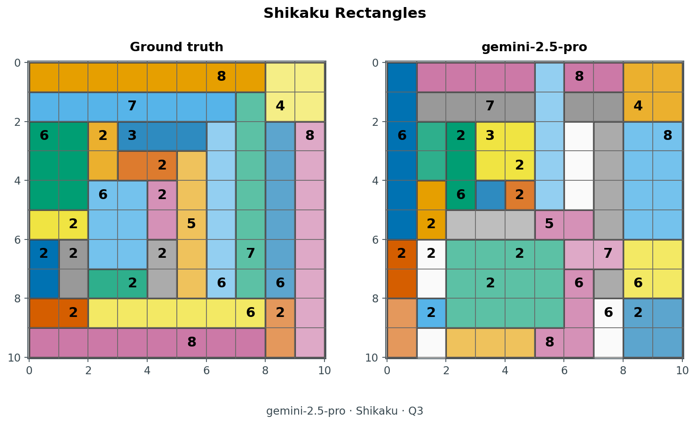 
      Gemini 2.5 Pro
    </td>
    <td style="text-align:center;">
      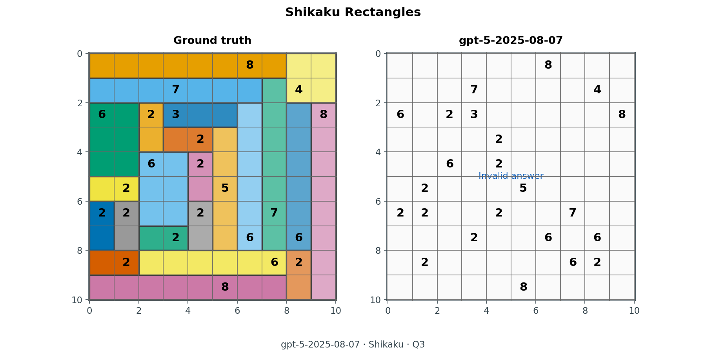 
      GPT‑5 (2025‑08‑07)
    </td>
  </tr>
</table>

### Two Segments
Place two straight segments inside a square to create a specified mix of triangles, quadrilaterals, pentagons, and hexagons. Endpoints must lie on the boundary. Models must construct valid geometric solutions to combinatorial constraints, balancing feasibility with target counts.

<table>
  <tr>
    <td style="text-align:center;">
      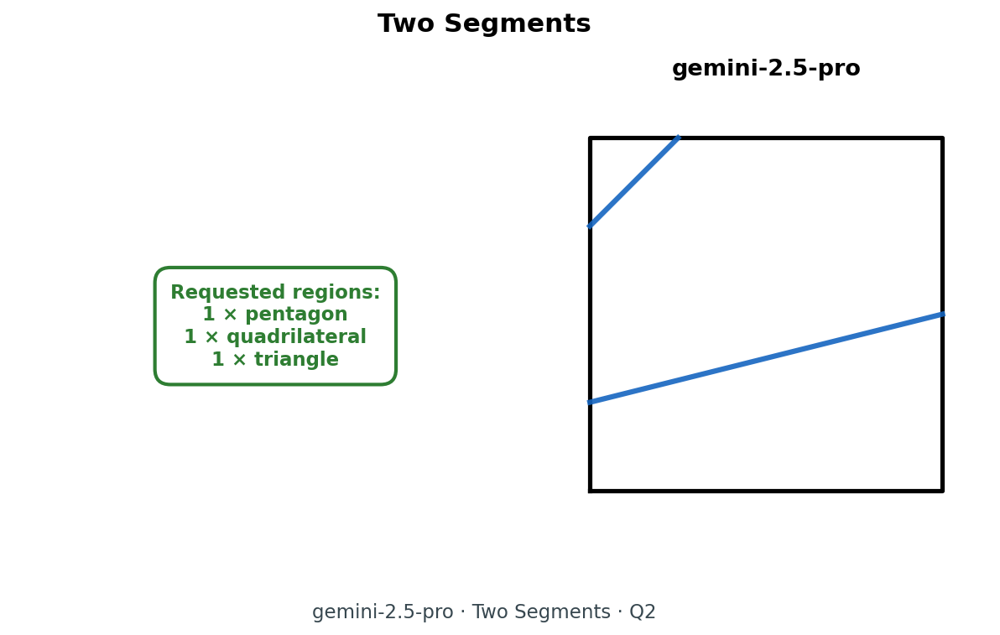 
      Gemini 2.5 Pro
    </td>
    <td style="text-align:center;">
      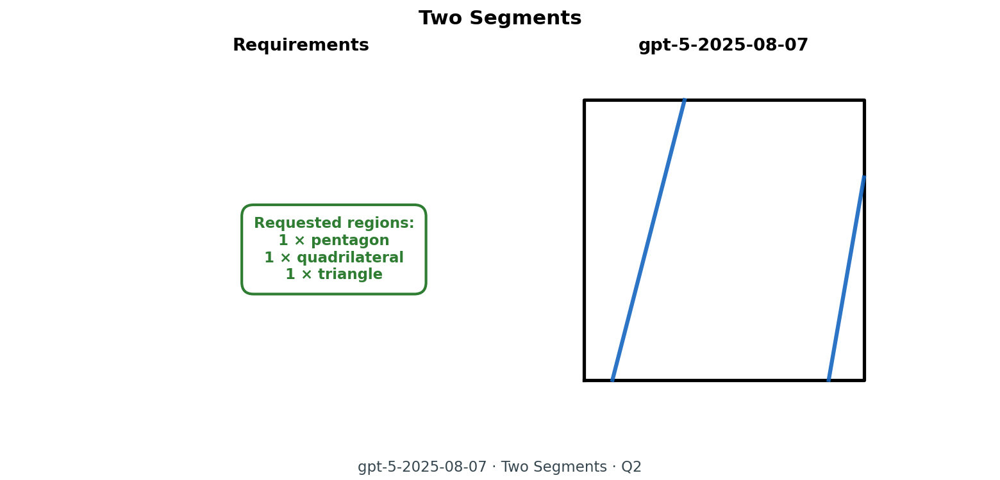 
      GPT‑5 (2025‑08‑07)
    </td>
  </tr>
</table>

---

## Narrative

- Visual and topological reasoning through multiple steps
- Questions which naturally force you to draw and visually solve, even though theoretically it can be solved analytically.
- Gather how these models would exploit and solve tasks which necessarily require humans to visualise and draw.

- Another spin?
    - We are measuring geometric intuition. And then stress testing it.
    

Interesting questions to show:
- change of configurations: breaking of pattern leads to spending more deliberate attention.
    - in corner configurations of N domains meeting in quad.
    - in axis configurations of half subdivision.
- This leads to a few open questions:
    - How is attention spent?
        - Is there an ablation here for different kind of attention spending mechanisms like sparse, ring, etc?
        - Can we teach the model to intentionally spend more attention on certain tasks? 